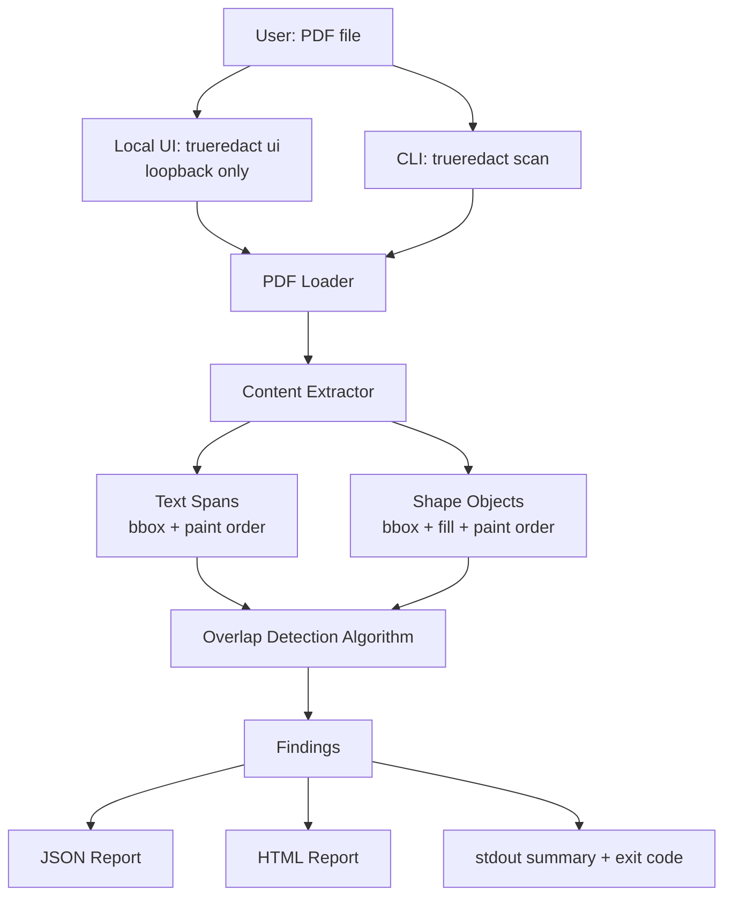

# TrueRedact — Architecture

> See [PROJECT-PLAN.md](./PROJECT-PLAN.md) for scope, [TECHNICAL-DESIGN.md](./TECHNICAL-DESIGN.md) for implementation-level detail (schemas, algorithm pseudocode, repo layout).

## System Architecture

There is no database and no network egress at any point in this system. The only socket is the loopback listener `trueredact ui` binds so a local browser can reach it; `scan` opens none, and nothing ever initiates an outbound connection. That is a deliberate constraint, not an omission — a tool whose entire purpose is auditing sensitive documents must not transmit them anywhere. See [DECISIONS.md](./DECISIONS.md#decision-no-network-io-anywhere-in-the-pipeline).

## Components

### CLI (`cli.py`)
- **Responsibility:** argument parsing, orchestration, exit-code determination, stdout summary rendering.
- **Input:** file path + flags (`--json`, `--html`, `--max-pages`, `--max-file-size-mb`, `-v`).
- **Output:** process exit code (`0` clean / `1` leak / `2` could not run / `3` no leak but not everything audited), stdout text, optionally written report files.
- **Dependencies:** the `core` package only — the CLI is a thin shell over pure logic, which is what makes `core` fully unit-testable without a subprocess.
- **Failure modes:** invalid path, unreadable file → caught and rendered as a clear message with exit code `2`, never a raw stack trace. A report that cannot be written is named on stderr but never overrides a leak already printed.

### PDF Loader (`core/loader.py`)
- **Responsibility:** open the file via PyMuPDF, verify it's actually a PDF by header (not by trusting the file extension), enforce size/page-count caps *before* any real parsing work begins.
- **Input:** file path.
- **Output:** an opened `pymupdf.Document`, or a `LoadError` carrying a user-facing message.
- **Dependencies:** PyMuPDF.
- **Failure modes:** encrypted/password-protected file, corrupted file, non-PDF file, oversized file. All raise the single `LoadError` type, deliberately not a hierarchy — every caller prints the message and exits `2`, so variants would be a distinction with no use. See [TECHNICAL-DESIGN.md § Error Handling](./TECHNICAL-DESIGN.md#error-handling).

### Content Extractor (`core/extractor.py`)
- **Responsibility:** per page, produce `TextSpan`, `ShapeObject`, and `ImageBox` records in unrotated page space, each shape/span tagged with its paint-order index, wrapped in one `PageContent`.
- **Input:** one page from the opened document.
- **Output:** one `PageContent`.
- **Dependencies:** PyMuPDF's `page.get_texttrace()`, `page.get_drawings()`, and `page.get_image_info()`. `get_texttrace()` is used rather than `get_text("dict")` because it is the only text API exposing `seqno`, the paint order the whole detection rests on.
- Also extracts `/Redact` annotation rectangles, which no shape threshold can reach: an unapplied mark paints nothing at all.
- **Deliberately absent:** no rotation matrix and no XObject recursion. The spike measured that both source APIs already report unrotated, **CropBox-relative** coordinates identically across `/Rotate` 0/90/180/270, and that MuPDF flattens form XObjects into page space with correctly interleaved sequence numbers. Neither transform is needed. See [spike-notes.md](./spike-notes.md).
- **Failure modes:** malformed content stream on a single page → whatever MuPDF salvaged is kept and `PageContent.error` is set from MuPDF's *error* channel, so the page becomes `UNCERTAIN` rather than silently `CLEAN`. Nothing is logged; the fault travels in the data. A single bad page never aborts the whole scan.

### Detection Algorithm (`core/detector.py`)
- **Responsibility:** the actual CS core. For each opaque, redaction-candidate shape, find text spans beneath it in paint order whose bounding box is substantially covered; classify each page's outcome as `FAKE_REDACTION`, `CLEAN`, or `UNCERTAIN`. Full algorithm in [TECHNICAL-DESIGN.md § Core Algorithm](./TECHNICAL-DESIGN.md#core-algorithm).
- **Input:** `list[TextSpan]`, `list[ShapeObject]` for one page.
- **Output:** `list[Finding]`.
- **Dependencies:** none beyond the domain types — this is a pure function with no I/O, which is intentional: it means the entire detection logic is unit-testable with hand-built fixtures, no PDF parsing required in most tests.
- **Failure modes:** none. It operates on already-extracted in-memory data and always returns at least one `Finding` per page.

### Local UI (`web.py`)
- **Responsibility:** serve one page and one `POST /scan` endpoint on `127.0.0.1` so the tool is usable without a terminal.
- **Input:** raw PDF bytes posted from the page.
- **Output:** a plain-English verdict plus the full HTML report, as JSON.
- **Dependencies:** the standard library only (`http.server`) and `core` — the runtime dependency count stays at one.
- **Failure modes:** rejects a non-loopback `Host`, a missing or wrong per-run token, an oversized `Content-Length`, and a stalled connection (30 s timeout). One bad upload returns an error and never stops the server.

### Reporters (`core/report_json.py`, `core/report_html.py`)
- **Responsibility:** serialize `list[Finding]` plus document metadata into JSON, or into a self-contained HTML file with rendered page-preview images and the leaked regions highlighted.
- **Input:** a `ScanReport` (metadata + findings).
- **Output:** a file written to disk, or a string returned to the caller.
- **Dependencies:** PyMuPDF (page-preview pixmap rendering, HTML report only).
- **Failure modes:** a page MuPDF refuses to rasterize yields a card with no preview rather than an exception — the preview illustrates a finding, the recovered text and spans table are the evidence.

## Data Flow

1. User points the CLI at a PDF.
2. Loader validates and opens it; size/page caps are enforced before any per-page work.
3. Extractor produces spans and shapes for each page.
4. Detector runs the pure overlap algorithm per page, entirely in memory.
5. Findings aggregate into one `ScanReport`.
6. Requested reporters (stdout always; JSON/HTML if flagged) render it.
7. CLI prints the summary, then writes any requested reports, then derives the exit code from the report — any `FAKE_REDACTION` finding anywhere sets exit code `1`, ahead of a failed report write.

## Core Entities

`TextSpan`, `ShapeObject`, `ImageBox`, `PageContent` (spans, shapes, images, `/Redact` boxes, and an optional `error`), `CoveredSpan`, `Finding` (verdict: `FAKE_REDACTION | CLEAN | UNCERTAIN`), `ScanReport`. Full field-level definitions in [TECHNICAL-DESIGN.md § Domain Model](./TECHNICAL-DESIGN.md#domain-model). All are in-memory dataclasses — none of this is persisted (see Database, below).

## Database

**Not applicable for MVP.** The tool is stateless by design: one PDF in, one report out, nothing retained between runs. Adding a database — even SQLite — before there is a concrete, real requirement for cross-run history would be exactly the kind of unrequested complexity this blueprint exists to prevent. If batch-scan history becomes a real need later, the natural shape is a single local SQLite file (`~/.trueredact/history.db`, one `scans` table) — intentionally not designed now, since designing storage before there's a real consumer of the stored data is guessing. See [TECHNICAL-DESIGN.md § Future Scope](./TECHNICAL-DESIGN.md#future-scope-explicitly-deferred).

## APIs / Interfaces

There is no remotely reachable API. The interface *is* the CLI plus the JSON/HTML report formats — exact contract (command syntax, JSON schema, exit codes) is in [TECHNICAL-DESIGN.md § Interface Contract](./TECHNICAL-DESIGN.md#interface-contract).

`trueredact ui` adds one loopback-only endpoint, `POST /scan`, taking raw PDF bytes. It was originally deferred and sketched as unauthenticated; it shipped **with** authentication, because a loopback socket a browser can reach is reachable by every page in that browser. See [DECISIONS.md](./DECISIONS.md).

## Security

The one real security surface: **this tool parses untrusted, potentially adversarial PDF input by design** — that's the entire point of the tool, auditing documents from anywhere. Full treatment in [TECHNICAL-DESIGN.md § Security-Relevant Design](./TECHNICAL-DESIGN.md#security-relevant-design) and [DECISIONS.md](./DECISIONS.md). Summary: enforce file-size/page-count caps before parsing; never evaluate embedded JavaScript or PDF actions; contain parser exceptions per-page, not per-document; pin the PyMuPDF version and run `pip-audit` in CI.

Summary of the UI's controls: loopback bind, `Host` header check against DNS rebinding, a random per-run token on every `POST`, a size cap enforced from `Content-Length` before the body is read, a connection timeout, uploads written to a private temp dir, and `Content-Security-Policy: default-src 'none'`.

**Explicitly not applicable:** authorization roles, rate limiting, secrets management — there is no multi-user surface and nothing reachable off the host.

## Performance

Target: a typical 10–50 page document scans in well under 3 seconds on an ordinary laptop. The workload is single-file, single-user, CPU-bound, and small — there is no concurrency, caching, or scaling concern worth designing for. Two guards are needed, both covered under Security: the size/page caps, and the per-path rectangle cap. The caps bound input; only the rectangle cap bounds *work*, since cost tracks vector content rather than byte count.

## Failure Handling

Full table in [TECHNICAL-DESIGN.md § Error Handling](./TECHNICAL-DESIGN.md#error-handling). Governing principle: every failure mode gets a distinct, human-readable message and a defined exit code — never a raw Python traceback surfaced to the end user — a single bad page never aborts the scan of the rest of the document, and nothing that fails *after* a verdict is reached may erase it.
