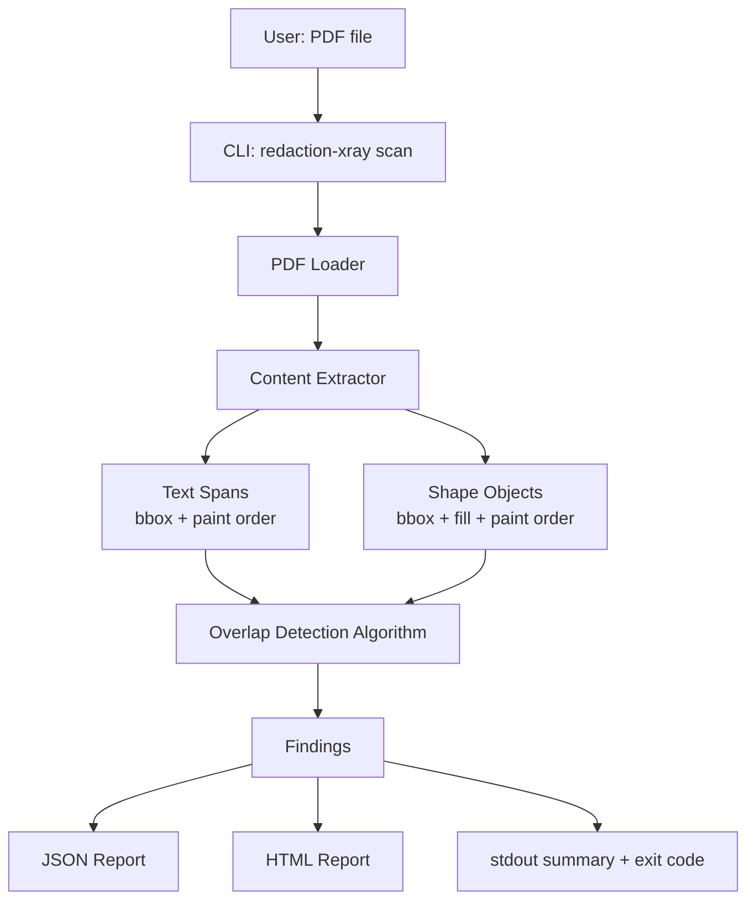

# Redaction X-Ray — Architecture

> See [PROJECT-PLAN.md](./PROJECT-PLAN.md) for scope, [TECHNICAL-DESIGN.md](./TECHNICAL-DESIGN.md) for implementation-level detail (schemas, algorithm pseudocode, repo layout).

## System Architecture

There is no client/server boundary, no database, and no network egress at any point in this system. That is a deliberate constraint, not an omission — a tool whose entire purpose is auditing sensitive documents must not transmit them anywhere. See [DECISIONS.md](./DECISIONS.md#decision-no-network-io-anywhere-in-the-pipeline).

## Components

### CLI (`cli.py`)
- **Responsibility:** argument parsing, orchestration, exit-code determination, stdout summary rendering.
- **Input:** file path + flags (`--json`, `--html`, `--max-pages`, `--max-file-size-mb`, `-v`).
- **Output:** process exit code (`0`/`1`/`2`), stdout text, optionally written report files.
- **Dependencies:** the `core` package only — the CLI is a thin shell over pure logic, which is what makes `core` fully unit-testable without a subprocess.
- **Failure modes:** invalid path, unreadable file → caught and rendered as a clear message with exit code `2`, never a raw stack trace.

### PDF Loader (`core/loader.py`)
- **Responsibility:** open the file via PyMuPDF, verify it's actually a PDF by header (not by trusting the file extension), enforce size/page-count caps *before* any real parsing work begins.
- **Input:** file path.
- **Output:** an opened `fitz.Document`, or a typed `LoadError`.
- **Dependencies:** PyMuPDF.
- **Failure modes:** encrypted/password-protected file, corrupted file, non-PDF file, oversized file — each a distinct, named `LoadError` variant (see [TECHNICAL-DESIGN.md § Error Handling](./TECHNICAL-DESIGN.md#error-handling)), not a generic exception.

### Content Extractor (`core/extractor.py`)
- **Responsibility:** per page, produce `TextSpan`, `ShapeObject`, and `ImageBox` records in unrotated page space, each shape/span tagged with its paint-order index, wrapped in one `PageContent`.
- **Input:** one page from the opened document.
- **Output:** one `PageContent`.
- **Dependencies:** PyMuPDF's `page.get_texttrace()`, `page.get_drawings()`, and `page.get_image_info()`. `get_texttrace()` is used rather than `get_text("dict")` because it is the only text API exposing `seqno`, the paint order the whole detection rests on.
- **Deliberately absent:** no rotation matrix and no XObject recursion. The spike measured that both source APIs already report unrotated mediabox coordinates identically across `/Rotate` 0/90/180/270, and that MuPDF flattens form XObjects into page space with correctly interleaved sequence numbers. Neither transform is needed. See [spike-notes.md](./spike-notes.md).
- **Failure modes:** malformed content stream on a single page → that page is skipped with a logged warning; a single bad page never aborts the whole scan.

### Detection Algorithm (`core/detector.py`)
- **Responsibility:** the actual CS core. For each opaque, redaction-candidate shape, find text spans beneath it in paint order whose bounding box is substantially covered; classify each page's outcome as `FAKE_REDACTION`, `CLEAN`, or `UNCERTAIN`. Full algorithm in [TECHNICAL-DESIGN.md § Core Algorithm](./TECHNICAL-DESIGN.md#core-algorithm).
- **Input:** `list[TextSpan]`, `list[ShapeObject]` for one page.
- **Output:** `list[Finding]`.
- **Dependencies:** none beyond the domain types — this is a pure function with no I/O, which is intentional: it means the entire detection logic is unit-testable with hand-built fixtures, no PDF parsing required in most tests.
- **Failure modes:** none (operates only on already-validated in-memory data).

### Reporters (`core/report_json.py`, `core/report_html.py`)
- **Responsibility:** serialize `list[Finding]` plus document metadata into JSON, or into a self-contained HTML file with rendered page-preview images and the leaked regions highlighted.
- **Input:** a `ScanReport` (metadata + findings).
- **Output:** a file written to disk, or a string returned to the caller.
- **Dependencies:** PyMuPDF (page-preview pixmap rendering, HTML report only).

## Data Flow

1. User points the CLI at a PDF.
2. Loader validates and opens it; size/page caps are enforced before any per-page work.
3. Extractor produces spans and shapes for each page.
4. Detector runs the pure overlap algorithm per page, entirely in memory.
5. Findings aggregate into one `ScanReport`.
6. Requested reporters (stdout always; JSON/HTML if flagged) render it.
7. CLI derives the exit code from the report — any `FAKE_REDACTION` finding anywhere sets exit code `1`.

## Core Entities

`TextSpan`, `ShapeObject`, `ImageBox`, `PageContent`, `Finding` (verdict: `FAKE_REDACTION | CLEAN | UNCERTAIN`), `ScanReport`. Full field-level definitions in [TECHNICAL-DESIGN.md § Domain Model](./TECHNICAL-DESIGN.md#domain-model). All are in-memory dataclasses — none of this is persisted (see Database, below).

## Database

**Not applicable for MVP.** The tool is stateless by design: one PDF in, one report out, nothing retained between runs. Adding a database — even SQLite — before there is a concrete, real requirement for cross-run history would be exactly the kind of unrequested complexity this blueprint exists to prevent. If batch-scan history becomes a real need later, the natural shape is a single local SQLite file (`~/.redaction-xray/history.db`, one `scans` table) — intentionally not designed now, since designing storage before there's a real consumer of the stored data is guessing. See [TECHNICAL-DESIGN.md § Future Scope](./TECHNICAL-DESIGN.md#future-scope-explicitly-deferred).

## APIs / Interfaces

MVP exposes no network-facing API. The interface *is* the CLI plus the JSON/HTML report formats — exact contract (command syntax, JSON schema, exit codes) is in [TECHNICAL-DESIGN.md § Interface Contract](./TECHNICAL-DESIGN.md#interface-contract). If a local drag-and-drop web UI is added later, it would be a single-process, localhost-only server with no authentication (nothing to authenticate — one user, one machine) and a single `POST /scan` endpoint. Deferred.

## Security

The one real security surface: **this tool parses untrusted, potentially adversarial PDF input by design** — that's the entire point of the tool, auditing documents from anywhere. Full treatment in [TECHNICAL-DESIGN.md § Security-Relevant Design](./TECHNICAL-DESIGN.md#security-relevant-design) and [DECISIONS.md](./DECISIONS.md). Summary: enforce file-size/page-count caps before parsing; never evaluate embedded JavaScript or PDF actions; contain parser exceptions per-page, not per-document; pin the PyMuPDF version and run `pip-audit` in CI.

**Explicitly not applicable:** authentication, authorization, rate limiting, secrets management, API-abuse protection — there is no multi-user surface and no network service anywhere in MVP.

## Performance

Target: a typical 10–50 page document scans in well under 3 seconds on an ordinary laptop. The workload is single-file, single-user, CPU-bound, and small — there is no concurrency, caching, or scaling concern worth designing for. The only real guard needed is the size/page cap already covered under Security, to stop a pathological huge file from hanging the process.

## Failure Handling

Full table in [TECHNICAL-DESIGN.md § Error Handling](./TECHNICAL-DESIGN.md#error-handling). Governing principle: every failure mode gets a distinct, human-readable message and a defined exit code — never a raw Python traceback surfaced to the end user — and a single bad page never aborts the scan of the rest of the document.
